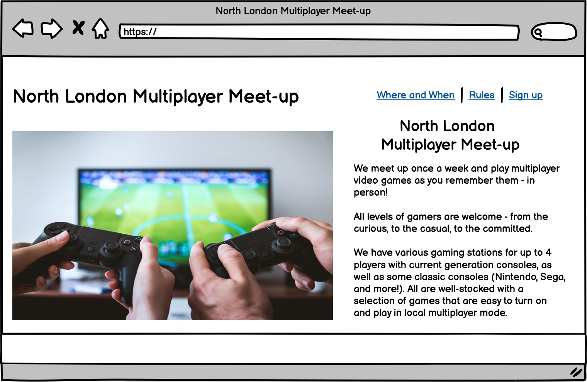
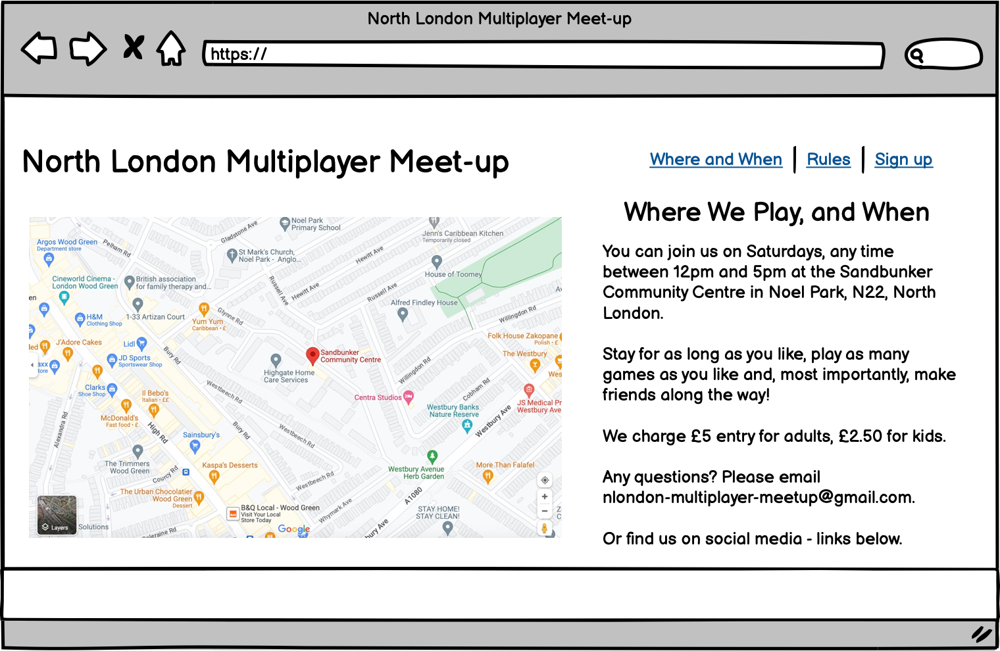
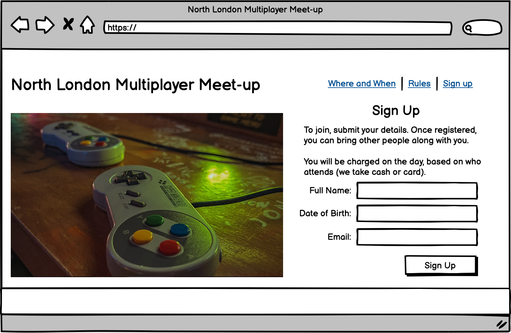

# North London Multiplayer Meet-up
Welcome! North London Multiplayer Meet-up is a site that gives gamers of all ages, skill and interest level all the information they need to attend a regular multi-player video games meet-up - giving them the opportunity to socialise as they play local multiplayer games across a range of different consoles. The idea is that it is more like how multiplayer gaming used to be - in-person! Rather than over the internet.

The site is targeted towards would-be in-person gamers who want to socialise and make friends through their interest. It will make clear the meet-up is for everyone, and by extension encourage people to bring their family or friends.

North London Multiplayer Meet-up will be useful for would-be gamers to see when and where they can attend the gaming meet-ups, the rules of the club, they types of consoles and games on offer, as well as information on how much they can expect to pay.

A live version of the project can be found here: ++ADD LINK+

## Contents

++FILL OUT AT END!++

## User Experience (UX)

## Design

++Colour, fonts etc with screen shots++

## Wireframes

Wireframes were used to work out the basic layout of each page. The wireframes were done in the style of how it will look on a desktop computer/laptop screen, but I planned to lay it out differently for tablet/mobile.

## Features

### Exisiting Features

#### Header

- The header section encapsulates the site's main H1 heading reading 'North London Multiplayer Meet-up' that links back to the landing/home page if pressed, as well as the nav bar that collapses out from a burger icon on mobile or is fully visible on tablet-size screen and upwards.
- Header will be the same on all pages of the site, with the nav bar making clear which section the user is viewing.

#### Nav Bar

- The nav bar collapses out from a burger icon on mobile screens. For tablet-size screens and upwards, all page links in the nav bar will be fully visible all the time on every page of the site. 
- The bar provides clickable links to the 'Where and When', 'Rules', and 'Sign Up' pages of the site.

#### Home/Landing Page

- The home/landing page features the site's main hero image, along with a block of succint text to convey what the weekly meet-up is for, and makes it sound appealing.

#### Where and When Page

- This page has details of where and when to attend the gaming meet-ups, as well as information on price, contact and social media. where there is a photo on other pages, there is an iframe containing a map showing exact location on this page instead.

#### Rules Page

- Here the rules of the meet-up is set out, in such a way to make it clear that it's a friendly and welcoming event that is for everyone. The section in effect doubles up and also conveys the ethos of the whole thing.

#### Sign Up Page

- In this page, users can input name, date of birth, and email address in order to sign up and be able to attend the meet-ups. It makes clear that once somebody is signed up, they can bring others with them - to avoid confusion.

#### Footer

- The footer will have links, via icons, to social media - Facebook, Twitter, Instagram. It will appear the same on all pages of the site.

### Features Left To Implement

- I would like the site to have a Multiplayer Meet-up finder feature on the Where and When page. This would allow users to view an interactive map and enter their location to see options near them. This would rely on the movement growing and being available in other areas. The site's main title/branding would of course have to change then, as currently it just is aimed at 'North London'.

## Testing

### Validator Testing

### Unfixed Bugs

## Deployment

The site was set up by creating a new repository on GitHub, using [this template](https://github.com/Code-Institute-Org/gitpod-full-template) from CodeInstitute.

The development environment used was GitPod. This was opened initially via the green 'GitPod' button that appeared on the repo's listing on GitHub. Then regular commits and pushes were sent from GitPod back to the repo on GitHub.

To deploy the live site from the GitHub repository, these steps as outlined on Code Institute's sample README file for the Love Running project were followed:
- In the GitHub repository, navigate to the Settings tab 
- From the source section drop-down menu, select the Master Branch
- Once the master branch has been selected, the page will be automatically refreshed with a detailed ribbon display to indicate the successful deployment. 

## Technologies Used

(++Link and give details on completion++)

- HTML5
- CSS
- GitHub
- GitPod
- Balsamiq
- Google Fonts
- Font Awesome
- Chrome DevTools
- Lighthouse
- W3C Markup Validation Service
- W3C CSS Validation Service

## Credits

### Content

- Ideas for structuring README.md files were gained from samples provided from former students, whose GitHub names are: Pelikantapeten, AlexaH88 

### Media

- Images used on the wireframes were taken from the [Pexels free-to-use stock photos website](https://www.pexels.com/)