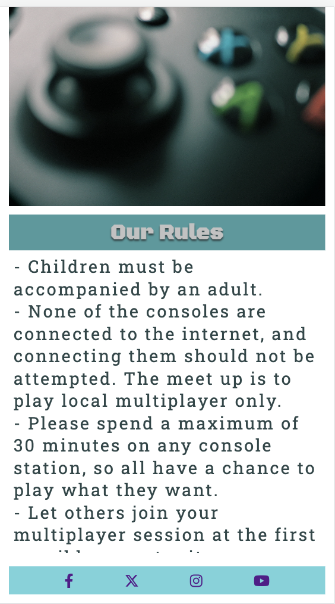
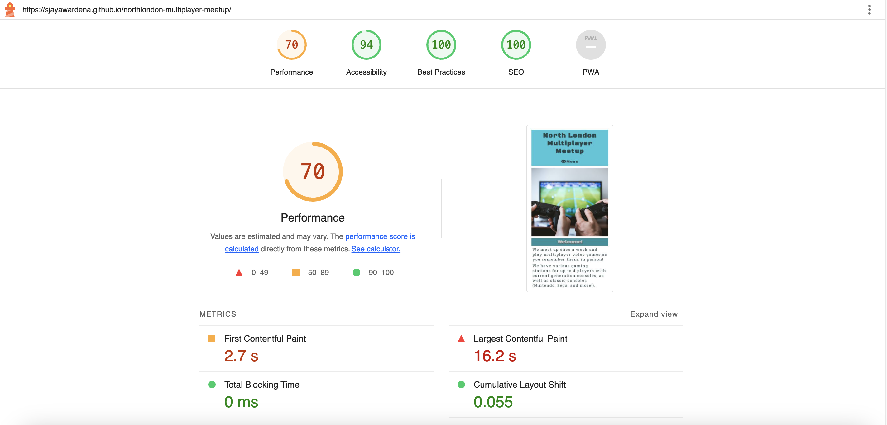

# North London Multiplayer Meetup

Welcome! North London Multiplayer Meet-up is a site that gives gamers of all ages, skill and interest level all the information they need to attend a regular multi-player video games meet-up - giving them the opportunity to socialise as they play local multiplayer games across a range of different consoles. The idea is that it is more like how multiplayer gaming used to be - in-person! Rather than over the internet.

The site is targeted towards would-be in-person gamers who want to socialise and make friends through their interest. It will make clear the meetup is for everyone.

North London Multiplayer Meet-up will be useful for would-be gamers to see when and where they can attend the gaming meet-ups, the rules of the club, they types of consoles and games on offer, as well as information on how much they can expect to pay.

A live version of the project can be found here: https://sjayawardena.github.io/northlondon-multiplayer-meetup/

## User Experience (UX)

### User Demographic

The website is intended for:

- People who live in north London who want to play computer games socially - in person rather than over the internet.
- Older gamers who may still want to play games they remember, and are not interest in or confident to play over the internet.
- Younger gamers who want to try retro computer games.

### User Stories

As a new user I want to:
- Find out about where and when the meetup takes place.
- Sign up to attend the meetup.
- Find details of the meetup's social media channels.
- Read up on the rules so I know what to expect.

As an existing user I want to:
- Check back to the site for any updates to the time and place of the meetup.
- Find contact details for any further question.
- Find key info to forward on to others who may be interested.

## Design

This is my first project of the course, so the design has been kept simple. 

I roughly followed the sequence of steps that were laid out in the Love Running walkthrough project of the course. 

The main feature that was borrowed and adapted from the Love Running project is the collapsable menu bar that appears on the mobile version of the site.

The site has 4 separate pages that can be navigated between using said menu bar - collapsable on mobile and static across the top of the header on tablet upwards.

### Colour Scheme

A color scheme was picked early on using the [Color Space](https://mycolor.space/) website.

Initially I was going to use the grey (#C2C2C2) for the background of the site but decided that made it look dated, so I used all these colours in combination for all the site's other elements.

I picked these colours because them to result in a clean, welcoming feel to the site. 

The photos chosen for each page were deemed to fit well within this colour scheme.

I also wanted the overall use of clearly defined blocks of colour to give the appearance of the menu pages of a retro computer game.

### Fonts

The two Google Fonts used for the site are Black Ops One, and Roboto Slab.

Black Ops One is used on menus, banners and buttons to convey a retro computer game feel.

Roboto Slab is used for all other general text, with a slightly increased letter spacing to default, because it has an informal look to it.

 

## Wireframes

Wireframes were used to work out the basic layout of each page. The wireframes were done in the style of how it will look on a desktop computer/laptop screen, but I planned to lay it out differently for tablet/mobile.

In the end I changed the layout on desktop from how it was set out in the below wireframes because the layout generally scaled up OK from mobile/tablet, but just needed columns adding for text on the 'Home' and 'Where and When pages', or the text/form fields narrowed and centered on the 'Rules' and 'Sign Up' pages.

## Features

### Exisiting Features

Screenshots in this section are from the mobile version of the site unless stated otherwise.

#### Header

- The header section encapsulates the site's main H1 heading reading 'North London Multiplayer Meet-up' that links back to the landing/home page if pressed, as well as the nav bar that collapses out from a burger icon on mobile or is fully visible on tablet-size screen and upwards.
- Header will be the same on all pages of the site, with the nav bar making clear which section the user is viewing.
- It is shown here on mobile with the dropdown menu collapsed out.

#### Nav Bar

- The nav bar collapses out from a burger icon on mobile screens. For tablet-size screens and upwards, all page links in the nav bar will be fully visible all the time on every page of the site. 
- The bar provides clickable links to the 'Where and When', 'Rules', and 'Sign Up' pages of the site.
- The section of the site that the user is currently viewing will be underlined.
- This screenshot shows the nav bar on a tablet.

#### Home/Landing Page

- The home/landing page features the site's main hero image, along with a block of succint text to convey what the weekly meet-up is for, and to make it sound appealing.

#### Where and When Page

- This page has details of where and when to attend the gaming meet-ups, as well as information on price, contact and social media. where there is a photo on other pages, there is an iframe containing a map showing exact location on this page instead.

#### Rules Page

- Here the rules of the meetup are set out, in such a way to make it clear that it's a friendly and welcoming event that is for everyone. The section in effect doubles up as a means of conveying the ethos of the whole thing.

#### Sign Up Page

- In this page, users can input name, date of birth, and email address in order to sign up and be able to attend the meetups.

#### Footer

- The footer will have links, via icons, to social media - Facebook, Twitter, Instagram, YouTube. It will appear the same on all pages of the site.
- It is shown here with the end of the block of text above it included.

### Features Left To Implement

- I would like the site to have a Multiplayer Meet-up finder feature on the Where and When page. This would allow users to view an interactive map and enter their location to see options near them. This would rely on the movement growing and being available in other areas. The site's main title/branding would of course have to change then, as currently it just is aimed at 'North London'.

## Deployment

The site was set up by creating a new repository on GitHub, using [this template](https://github.com/Code-Institute-Org/gitpod-full-template) from CodeInstitute.

The development environment used was GitPod. This was opened initially via the green 'GitPod' button that appeared on the repo's listing on GitHub. 

The initial 'git add', 'git commit' and 'git push' were made on 13 August 2023. There have been a further 60 commits since then.

Then regular commits and pushes were sent from GitPod back to the repo on GitHub.

To deploy the live site from the GitHub repository, these steps as outlined on Code Institute's sample README file for the Love Running project were followed:
- In the GitHub repository, navigate to the Settings tab 
- From the source section drop-down menu, select the Master Branch
- Once the master branch has been selected, the page will be automatically refreshed with a detailed ribbon display to indicate the successful deployment. 

## Technologies Used

- HTML5 - to code for each page.
- CSS - to style each page.
- [Github](https://github.com/) - to create and store the repository for the website.
- [GitPod](https://www.gitpod.io/) - the Integrated Development Environment (IDE) used to build the site, and to 'git commit' and 'git push' back to the Github repository.
- [Balsamiq](https://balsamiq.com/wireframes/) - Application used on Mac to create wireframes.
- [Google Fonts](https://fonts.google.com/) - both fonts used in this project were chosen via Google Fonts and linked to at the top of the 'style.css' file.
- [Font Awesome](https://fontawesome.com/) - a kit from the Font Awesome website was used for the social media icons in the footer.
- [icons8 website](https://icons8.com/) - the favicons were downloaded from here.
- [Color Space website](mycolor.space) - used to select colour scheme.
- [Chrome DevTools](https://developer.chrome.com/docs/devtools/) - used to inspect the website and its performance at every step of development.
- [Google Maps](https://www.google.com/maps) - used to show the exact location for the meetup - it is embedded in the site via an iframe.
- [Lighthouse](https://developer.chrome.com/docs/lighthouse/overview/) - used to assess the overall quality of the site.
- [W3C Markup Validation site](https://validator.w3.org/) - used to find issues in the html for the site and to resolve them 
- [W3C CSS Validation site](https://jigsaw.w3.org/css-validator/) - used to find issues in the CSS for the site and to resolve them.
- [Am I Responsive? site](https://ui.dev/amiresponsive) - used to generate screenshots of the site across different devices and screen sizes.

## Testing

The website was tested on the Chrome, Safari and Firefox browsers. On each browser, it was inspected on mobile view (including iPhone SE and Galaxy Fold), tablet view (including iPad, iPad Mini and iPad Air), and desktop view.

Problems encountered in this phase included: 
- The main h1 heading overflowing it's flexbox container, which was fixed by setting the min-width property to 0, and aligning the header individually to centre.
- The Submit (Let's Game!) button of the sign-up form moving up and appearing over the form itself in horizontal mobile and tablet views. This was happening because I had set the maximum page height to 100vh, with no 'overflow' property and 'scroll' value in the CSS. I fixed it by removing the maximum page height rule completely.
- The title banners on each page were also resizing in an unexpected way and pushing the content above them up when the website was resized in 'responsive' view mode in browser inspectors. This was again fixed by removing the maximum page height CSS rule.
- When viewed in Firefox, the Rules page's scrollable list of rules was only able to scroll sideways to reveal more text, whereas it was intended to scroll vertically (and did on both the other browsers, in every type of view). This was fixed by adding a flex display to the rules list in the CSS file, and setting the flex-direction to vertical.

### Validator Testing

The site's style.css has passed through the [W3C validation](https://validator.w3.org/) process.

The html for all pages of the site has also passed through the [W3 validation] process.

 

All pages on the site have all scored adequately on the reports generated by Lighthouse.

 

 

### Unfixed Bugs

There are no unfixed bugs that I am aware of.

## Credits

### Content

- I produced the written content, layout, colour scheme and design of the website.
- Ideas for structuring README.md files were gained from samples provided from former students, whose GitHub names are: Pelikantapeten, AlexaH88 

### Media

- Photos used on the website and wireframes were taken from the [Pexels free-to-use stock photos website](https://www.pexels.com/)